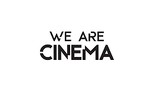
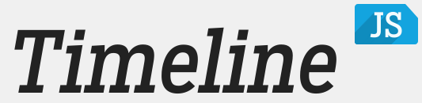
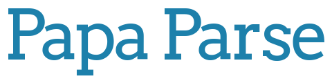

Our purpose is to build a functional and easy-to-use prototype for **exploring open and curated cultural data with virtual reality** in a museum setting, providing a **modern, fun and intriguing visitor experience**.

We propose setting up a VR viewer device next to the museum object, which is used to access detailed views and interesting facts in a 360° timeline with voiceovers and imagery. Focusing on one art piece, we collected data about its history, inception, and conservation efforts to present day, building a concept and process that anyone could easily reuse for any art object in any museum.

## Demo

Have a look at our working demo based on the *Allianzteppich* currently displayed at the Swiss National Museum:

*Works well in modern browsers and mobile phones, supports [Google Cardboard](https://vr.google.com/cardboard/get-cardboard/) and other [WebVR devices](https://webvr.info/).* 

## How does it work?

Anyone interested in creating such experience in an exhibition with open and curated data can use this! Not only are the technologies behind our process 100% open source, but we have implemented this based on the Timeline.js data standard supported by the Knight Foundation, to extend the popular 2D web timelines with these 3D editions. Visit our project's [README](https://github.com/we-art-o-nauts/we-art-o-nauts/blob/master/README.md) for more information.

## Data 

The **[Allianzteppich](https://www.nationalmuseum.ch/sammlung_online/?lauftext=DEP-65&sID=&numOf=30&detailID=177198#177198)** (nationalmuseum.ch) is a prominent (huge!) tapestry of great historical importance in the permanent collection of the Swiss [National Museum](http://nationalmuseum.ch/). 

At the 2018 Open Cultural Data Hackathon we received curated data from the museum catalogue, and further researched information online and in the museum library to create a timeline of events surrounding its creation and history. 

In particular, [Der Allianzteppich und die Fragen von Selbstdarstellung, Repräsentation und Rezeption](https://www.e-periodica.ch/cntmng?pid=kas-002:2002:53::362) by Sigrid Pallmert, and the Wikipedia entry on [Bildwirkerei](https://de.wikipedia.org/wiki/Bildwirkerei) was of use to us. 

Thanks to Dominik Sievi, Loïc Jaouen and other fellow GLAMhackers for help with queries and concept.

## Technology 

Courtesy of [We Are Cinema](http://www.wearecinema.ch/), the first VR cinema in Switzerland, we were able to use several [Gear VR](https://www.oculus.com/gear-vr/) headsets with the [Oculus](https://www.oculus.com/gear-vr/) browser for brainstorming ideas and testing our application at the Hackathon.

The [Timeline.js](https://timeline.knightlab.com/) was instrumental to our concept, providing a simple open schema for collecting information about historical timelines that we used to collect and display information to our viewers.

We used this "powerful, in-browser CSV parser for big boys and girls" to work with data from the Timeline.js-formatted spreadsheet that we shared with our team using [Google Sheets](https://www.google.com/sheets/about/).

Our secret weapon is this superawesome toolkit for building Virtual Reality experiences using Web standards. Easy enough for non-coders to understand and get started with, flexible enough to be used as the basis for blockbuster productions, we think [A-Frame](https://aframe.io/) is just about the llama's pyjamas.

## An [Open Source](https://github.com/we-art-o-nauts) project

## Started at [#GLAMHack 2018](https://glam.opendata.ch/)

## The A-Team

- [Marina Pardini](http://www.marinapardini.com/) (UX designer)
- [Kamontat Chantrachirathumrong](https://github.com/kamontat) (Developer)
- [Xia Willuhn](https://github.com/xwilluhn) (Developer)
- [Oleg Lavrovsky](https://github.com/loleg) (Developer)
- [Birk Weiberg](https://github.com/birk) (Expert)

